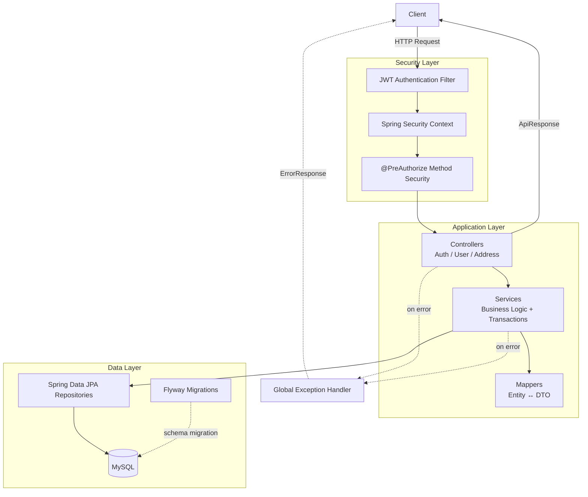
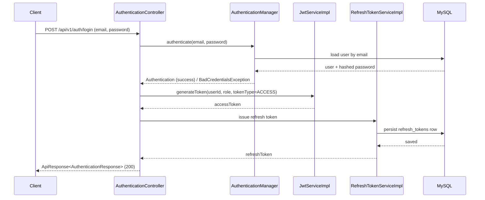
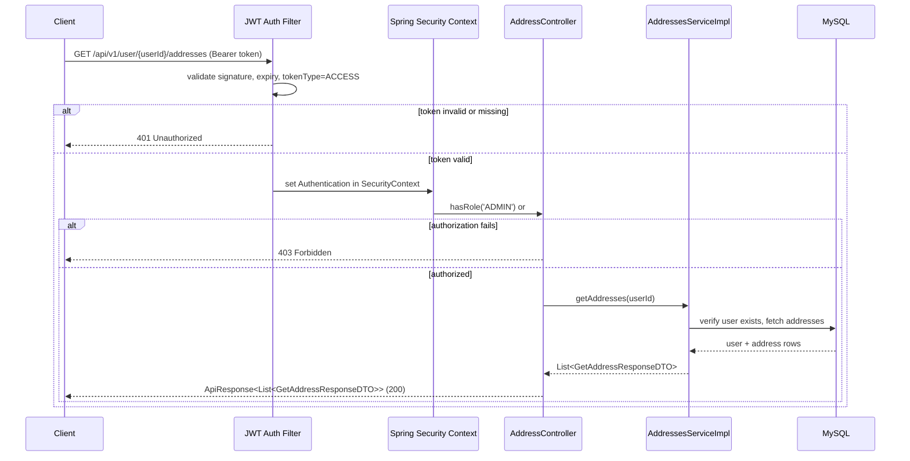
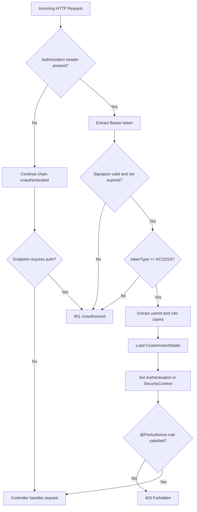
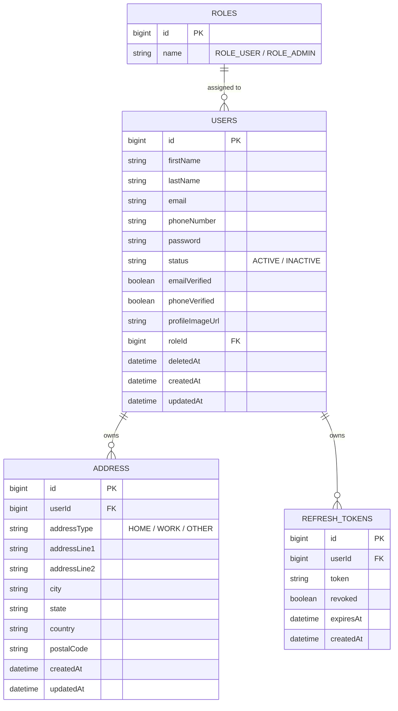

# NovaCart User Auth Service

A production-oriented Spring Boot service for user authentication, authorization, profile management, and address management. The project provides a secure REST API for user registration, login, token refresh, logout, admin-driven user operations, and user-owned address CRUD workflows.

---

## Overview

This repository implements the authentication and identity layer for a larger e-commerce ecosystem. It exposes a set of REST endpoints that allow clients to register users, authenticate with email and password, manage JWT access and refresh tokens, and perform user and address operations with role-based access control.

The service is built with Spring Boot, Spring Security, Spring Data JPA, Flyway, and MySQL. It uses JWT-based authentication, BCrypt password hashing, OpenAPI documentation, and a global exception-handling strategy.

---

## Features

### Authentication
- User registration with validation and duplicate detection
- User login with email/password authentication
- JWT access token generation
- JWT refresh token generation
- Refresh token rotation on refresh requests
- Logout by revoking the refresh token
- Password hashing using BCrypt

### Authorization
- Spring Security-based request protection
- Method-level authorization using Spring Method Security
- Admin-only access for user management operations
- User self-service access for address operations

### User Management
- Paginated retrieval of active users
- Retrieval of deleted users
- Soft delete of users
- Restore of soft-deleted users
- Permanent user removal
- Current-user profile retrieval and update
- Current-user self-deletion

### Address Management
- Create addresses for a specific user
- Retrieve all addresses for a user
- Retrieve a single address by ID
- Update an existing address
- Delete an address

### Validation
- Bean validation on request bodies and path variables
- Input constraints for email, phone number, password strength, and field length

### Pagination, Sorting, and Filtering
- Paginated user listing
- Sorting by supported fields such as ID, name, email, phone number, status, and timestamps
- Filtering by keyword, phone number, status, role, email verification, and phone verification

### Soft Delete
- Users are marked as deleted using a soft-delete field rather than being hard-deleted immediately
- Deleted users can be restored through dedicated endpoints

### Security
- Stateless JWT authentication
- Role-based authorization
- Password encoding
- Token validation and revocation handling

### Swagger / OpenAPI
- OpenAPI documentation enabled through Springdoc
- Swagger UI available for interactive API exploration

### Flyway
- Database schema managed through Flyway migrations
- Initial schema creation for roles, users, addresses, and refresh tokens

### SonarQube
- SonarQube integration configured in Gradle and CI workflow

### CI/CD
- GitHub Actions workflow configured to build, test, generate coverage, and run SonarQube analysis

### Logging and Exception Handling
- Structured logging in controllers, services, filters, and utilities
- Centralized exception handling for validation, authentication, resource lookup, and general server errors

---

## Tech Stack

| Category | Technology | Version / Notes |
|---|---|---|
| Language | Java | 21 |
| Framework | Spring Boot | 4.1.0 |
| Build Tool | Gradle | 9.5.1 (wrapper) |
| Web | Spring Web MVC | Included via Spring Boot |
| Data Access | Spring Data JPA | Included via Spring Boot |
| Security | Spring Security | Included via Spring Boot |
| JWT | jjwt | 0.12.6 |
| Validation | Jakarta Validation | Included via Spring Boot |
| Database | MySQL | Configured via JDBC datasource |
| Migrations | Flyway | Included via Spring Boot |
| API Docs | Springdoc OpenAPI | 3.0.1 |
| Code Quality | SonarQube | Plugin 6.2.0.5505 |
| Test Coverage | JaCoCo | 0.8.13 |
| Lombok | Lombok | Annotation processing enabled |

---

## Architecture

This service follows a layered architecture:

1. Controllers receive HTTP requests and delegate to services.
2. Services contain business logic and transaction boundaries.
3. Repositories interact with the MySQL database through Spring Data JPA.
4. Security filters authenticate requests before controller logic is reached.
5. Mappers transform entity objects into DTOs and vice versa.
6. Global exception handlers standardize error responses.

### Package Overview

- auth: authentication controllers, DTOs, mapper, services, JWT logic, refresh token handling, and security classes
- user: user management and address management controllers, DTOs, entities, mappers, repositories, and specifications
- common: shared configuration, DTOs, audit base class, enums, custom exceptions, security utilities, and shared repositories

### Request Flow

A typical request follows this flow:

1. Client sends a request to the REST API.
2. JWT filter checks the Authorization header when present.
3. Spring Security validates access and applies method-level authorization rules.
4. The controller receives the request and delegates to the appropriate service.
5. The service performs validation, persistence, and business rules.
6. The repository interacts with the database.
7. The response is wrapped in a standard API response format.
8. Any error is handled consistently through the global exception handler.

---

## Project Structure

```text
.
├── .github/
│   └── workflows/
│       └── ci.yml
├── gradle/
│   └── wrapper/
├── src/
│   ├── main/
│   │   ├── java/
│   │   │   └── com/
│   │   │       └── test/
│   │   │           └── userauthservice/
│   │   │               ├── auth/
│   │   │               ├── common/
│   │   │               └── user/
│   │   └── resources/
│   │       ├── application.properties
│   │       └── db/
│   │           └── migration/
│   └── test/
│       └── java/
├── build.gradle
├── gradlew
├── gradlew.bat
├── settings.gradle
└── README.md
```

---

## Security

This project uses Spring Security with a stateless JWT-based authentication model.

### Spring Security
- CSRF is disabled for the API layer.
- Requests are authenticated by default unless explicitly permitted.
- Public routes are allowed for authentication endpoints and Swagger documentation.

### JWT
- Access tokens are issued for short-lived API authorization.
- Refresh tokens are issued for long-lived session renewal.
- Tokens include claims for user ID, role, and token type.

### Access Token
- Used to authorize protected API requests.
- Validated by the JWT authentication filter.

### Refresh Token
- Stored in the database as a persistent entity.
- Used by the refresh-token endpoint to obtain a new access token.

### Refresh Token Rotation
- When a refresh token is used, the old token is revoked and a new refresh token is generated.
- This reduces the risk of replay attacks.

### Logout
- Logout revokes the supplied refresh token.
- The token is marked as revoked in the database.

### Role-Based Authorization
- Users are assigned a role from the roles table.
- Admin endpoints are protected with role checks.
- Address management also allows the resource owner or an admin to access the data.

### Method Security
- Method-level access rules are applied with Spring Method Security.
- This is used on controller endpoints such as user administration and address access.

### JWT Filter
- A custom filter intercepts incoming requests and populates the Spring Security context when a valid JWT is present.

---

## Database

The service uses MySQL and manages schema evolution through Flyway.

### Core Tables

| Table | Purpose |
|---|---|
| roles | Stores application roles such as ROLE_USER and ROLE_ADMIN |
| users | Stores user accounts, profile fields, status, and role assignment |
| address | Stores user address records |
| refresh_tokens | Stores refresh tokens and their revocation state |

### Relationships
- One role can be assigned to many users.
- One user can have many addresses.
- One user can own many refresh tokens.

### Audit and Soft-Delete Fields
- Common audit fields exist on entity classes via a base auditable entity.
- Users and addresses include created, updated, and deleted timestamps.
- Users support soft deletion through a deleted_at field.

---

## API Documentation

The project exposes OpenAPI documentation via Swagger UI at `/swagger-ui/index.html`. The tables and collapsible sections below are generated directly from the controllers, DTOs, validation annotations, and the global exception handler in this repository.

### Badge Legend

   

### Standard Response Envelopes

All successful responses are wrapped in `ApiResponse<T>` (`common/dto/ApiResponse.java`):

```json
{
  "success": true,
  "message": "string",
  "data": {}
}
```

Paginated `data` payloads use `PageResponse<T>` (`common/dto/PageResponse.java`):

```json
{
  "content": [],
  "pageNumber": 0,
  "pageSize": 10,
  "totalElements": 0,
  "totalPages": 0,
  "numberOfElements": 0,
  "first": true,
  "last": true
}
```

All error responses use `ErrorResponse` (`common/exception/dto/ErrorResponse.java`), produced by `GlobalExceptionHandler`:

```json
{
  "timestamp": "2026-08-03T10:15:30",
  "status": "NOT_FOUND",
  "error": "USER_NOT_FOUND",
  "message": "No User Found with the given id: 42",
  "path": "/api/v1/users/get-user-by-id/42"
}
```

| Exception | HTTP Status | `error` value |
|---|---|---|
| `ResourceNotFoundException` | 404 | contextual, e.g. `USER_NOT_FOUND`, `ADDRESS_NOT_FOUND`, `REFRESH_TOKEN_NOT_FOUND`, `ROLE_USER_NOT_FOUND` |
| `DuplicateResourceException` | 409 | contextual |
| `InvalidOperationException` | 409 | contextual |
| `PasswordMismatchException` | 409 | `PASSWORD_MISMATCH` |
| `InvalidTokenException` | 401 | `REFRESH_TOKEN_INVALID` |
| `MethodArgumentNotValidException` (`@Valid` body errors) | 400 | `VALIDATION_ERROR` |
| `ConstraintViolationException` (e.g. `@Positive` path vars) | 400 | `VALIDATION_ERROR` |
| `DataIntegrityViolationException` | 400 | `DATABASE_CONSTRAINT_VIOLATION` |
| `MethodArgumentTypeMismatchException` (bad enum query param) | 400 | `INVALID_PARAMETER` |
| Spring Security `AccessDeniedException` (role/ownership check failed) | 403 | not wrapped in `ErrorResponse` — handled by Spring Security's default filter chain before reaching the controller advice |
| Uncaught `Exception` | 500 | `SOMETHING_WENT_WRONG` |

---

### Architecture Diagram



### Sequence Diagram — Login Flow



### Sequence Diagram — Protected Resource Request Flow (Address Management)



### Flowchart — JWT Authentication Filter



### Entity Relationship Diagram



---

### Authentication Endpoints

| Method | Endpoint | Access | Purpose |
|---|---|---|---|
| POST | `/api/v1/auth/register` |  | Register a new user |
| POST | `/api/v1/auth/login` |  | Authenticate a user and issue tokens |
| POST | `/api/v1/auth/refresh-token` |  | Refresh access token using a refresh token |
| POST | `/api/v1/auth/logout` |  | Revoke a refresh token |

<details>
<summary><strong>POST /api/v1/auth/register</strong></summary>

### Description
Registers a new user with `ROLE_USER`, `status=ACTIVE`, `emailVerified=false`, and `phoneVerified=false`, then issues an access/refresh token pair.

### Authentication Required?
No (public endpoint)

### Required Role
N/A

### Headers
```
Content-Type: application/json
```

### Request
```json
{
  "firstName": "Krishna",
  "lastName": "Verma",
  "email": "krishna.verma@ddverse.in",
  "phoneNumber": "9876543210",
  "password": "Str0ng@Pass",
  "confirmPassword": "Str0ng@Pass"
}
```

### Success Response
```json
{
  "success": true,
  "message": "User registered successfully.",
  "data": {
    "accessToken": "eyJhbGciOiJIUzI1NiJ9...",
    "refreshToken": "eyJhbGciOiJIUzI1NiJ9...",
    "tokenType": "Bearer",
    "accessTokenExpiresAt": "2026-08-03T10:30:00Z",
    "refreshTokenExpiresAt": "2026-09-02T10:15:00Z",
    "user": {
      "id": 101,
      "firstName": "Krishna",
      "lastName": "Verma",
      "email": "krishna.verma@ddverse.in",
      "phoneNumber": "9876543210",
      "status": "ACTIVE"
    }
  }
}
```

### Error Response
```json
{
  "timestamp": "2026-08-03T10:15:30",
  "status": "CONFLICT",
  "error": "PASSWORD_MISMATCH",
  "message": "Password and confirm password do not match.",
  "path": "/api/v1/auth/register"
}
```
Other possible errors: `400 VALIDATION_ERROR` (bean validation failures), `404 ROLE_USER_NOT_FOUND` (if the `ROLE_USER` seed row is missing).

### Validation Rules
- `firstName`: required, max 100 characters
- `lastName`: required, max 100 characters
- `email`: required, must be a valid email format
- `phoneNumber`: required, must match `^[6-9]\d{9}$` (10-digit Indian mobile number)
- `password`: required, 8–100 characters, must match `^(?=.*[a-z])(?=.*[A-Z])(?=.*\d)(?=.*[@$!%*?&#^()_+\-=\[\]{};':"\\|,.<>/?]).{8,100}$` (at least one lowercase, one uppercase, one digit, one special character)
- `confirmPassword`: required, must equal `password`

### Notes
- Password is hashed with BCrypt before persistence.
- New users always start as `ROLE_USER`; there is no self-service admin registration.

</details>

<details>
<summary><strong>POST /api/v1/auth/login</strong></summary>

### Description
Authenticates a user with email and password and issues a new access/refresh token pair.

### Authentication Required?
No (public endpoint)

### Required Role
N/A

### Headers
```
Content-Type: application/json
```

### Request
```json
{
  "email": "krishna.verma@ddverse.in",
  "password": "Str0ng@Pass"
}
```

### Success Response
```json
{
  "success": true,
  "message": "Login successful.",
  "data": {
    "accessToken": "eyJhbGciOiJIUzI1NiJ9...",
    "refreshToken": "eyJhbGciOiJIUzI1NiJ9...",
    "tokenType": "Bearer",
    "accessTokenExpiresAt": "2026-08-03T10:30:00Z",
    "refreshTokenExpiresAt": "2026-09-02T10:15:00Z",
    "user": {
      "id": 101,
      "firstName": "Krishna",
      "lastName": "Verma",
      "email": "krishna.verma@ddverse.in",
      "phoneNumber": "9876543210",
      "status": "ACTIVE"
    }
  }
}
```

### Error Response
```json
{
  "timestamp": "2026-08-03T10:15:30",
  "status": "INTERNAL_SERVER_ERROR",
  "error": "SOMETHING_WENT_WRONG",
  "message": "An unexpected error occurred.",
  "path": "/api/v1/auth/login"
}
```
Note: invalid credentials are rejected by Spring Security's `AuthenticationManager` as `BadCredentialsException`; there is no dedicated handler for it in `GlobalExceptionHandler`, so it currently falls through to the generic catch-all mapping above rather than a dedicated `401`.

### Validation Rules
- `email`: required, must be a valid email format
- `password`: required

### Notes
- Access and refresh tokens carry `userId`, `role`, and `tokenType` claims in addition to standard `sub`/`iat`/`exp`.
- Access tokens expire in 15 minutes; refresh tokens expire in 30 days.

</details>

<details>
<summary><strong>POST /api/v1/auth/refresh-token</strong></summary>

### Description
Exchanges a valid, non-revoked refresh token for a new access token, rotating the refresh token (the old one is revoked and a new one issued).

### Authentication Required?
No (public endpoint — authentication is performed via the refresh token in the body, not a bearer access token)

### Required Role
N/A

### Headers
```
Content-Type: application/json
```

### Request
```json
{
  "refreshToken": "eyJhbGciOiJIUzI1NiJ9..."
}
```

### Success Response
```json
{
  "success": true,
  "message": "Access token refreshed successfully.",
  "data": {
    "accessToken": "eyJhbGciOiJIUzI1NiJ9...",
    "refreshToken": "eyJhbGciOiJIUzI1NiJ9...",
    "tokenType": "Bearer",
    "accessTokenExpiresAt": "2026-08-03T10:45:00Z",
    "refreshTokenExpiresAt": "2026-09-02T10:30:00Z",
    "user": {
      "id": 101,
      "firstName": "Krishna",
      "lastName": "Verma",
      "email": "krishna.verma@ddverse.in",
      "phoneNumber": "9876543210",
      "status": "ACTIVE"
    }
  }
}
```

### Error Response
```json
{
  "timestamp": "2026-08-03T10:15:30",
  "status": "UNAUTHORIZED",
  "error": "REFRESH_TOKEN_INVALID",
  "message": "Invalid refresh token",
  "path": "/api/v1/auth/refresh-token"
}
```
Also possible: `404 REFRESH_TOKEN_NOT_FOUND` when the token is not found, already revoked, or soft-deleted in the database.

### Validation Rules
- `refreshToken`: required, non-blank

### Notes
- Refresh token rotation reduces replay-attack risk: each refresh invalidates the previously issued refresh token.

</details>

<details>
<summary><strong>POST /api/v1/auth/logout</strong></summary>

### Description
Revokes the supplied refresh token, ending the associated session.

### Authentication Required?
Yes — this route is **not** in the security config's `permitAll` list, so a valid `Bearer` access token is required even though the endpoint body only carries a refresh token.

### Required Role
Any authenticated user (`ROLE_USER` or `ROLE_ADMIN`)

### Headers
```
Content-Type: application/json
Authorization: Bearer <accessToken>
```

### Request
```json
{
  "refreshToken": "eyJhbGciOiJIUzI1NiJ9..."
}
```

### Success Response
```json
{
  "success": true,
  "message": "Logged out successfully.",
  "data": null
}
```

### Error Response
```json
{
  "timestamp": "2026-08-03T10:15:30",
  "status": "NOT_FOUND",
  "error": "REFRESH_TOKEN_NOT_FOUND",
  "message": "Refresh token is invalid.",
  "path": "/api/v1/auth/logout"
}
```
Also possible: `401 REFRESH_TOKEN_INVALID` for a malformed/expired refresh token, and `401` from the JWT filter itself if the `Authorization` header is missing or invalid.

### Validation Rules
- `refreshToken`: required, non-blank

### Notes
- Marks the refresh token row as revoked in the `refresh_tokens` table rather than deleting it.

</details>

---

### User Management Endpoints

| Method | Endpoint | Access | Purpose |
|---|---|---|---|
| GET | `/api/v1/users/get-all-users` |  | Retrieve paginated active users |
| GET | `/api/v1/users/get-user-by-id/{userId}` |  | Retrieve a user by ID |
| DELETE | `/api/v1/users/remove-user/{userId}/permanent` |  | Permanently delete a user |
| DELETE | `/api/v1/users/remove-user/{userId}` |  | Soft delete a user |
| PATCH | `/api/v1/users/restore-user/{userId}` |  | Restore a soft-deleted user |
| GET | `/api/v1/users/get-deleted-users` |  | Retrieve deleted users |
| GET | `/api/v1/users/get-deleted-user-by-id/{userId}` |  | Retrieve a deleted user by ID |
| PATCH | `/api/v1/users/update-user-by-id/{userId}` |  | Update a user by ID |
| GET | `/api/v1/users/me` |  | Retrieve the currently authenticated user |
| PATCH | `/api/v1/users/me` |  | Update the currently authenticated user |
| DELETE | `/api/v1/users/me` |  | Soft delete the currently authenticated user |

<details>
<summary><strong>GET /api/v1/users/get-all-users</strong></summary>

### Description
Returns a paginated, filterable, sortable list of active (non-deleted) users.

### Authentication Required?
Yes

### Required Role
`ROLE_ADMIN`

### Headers
```
Authorization: Bearer <accessToken>
```

### Request
Query parameters (bound via `SearchUserRequestDTO` + pagination/sort params), all optional:
```
keyword=krishna
phoneNumber=9876543210
status=ACTIVE
roleId=1
emailVerified=true
phoneVerified=false
pageNumber=0
size=10
sortBy=CREATED_AT
sortDirection=DESC
```

### Success Response
```json
{
  "success": true,
  "message": "Users retrieved successfully.",
  "data": {
    "content": [
      {
        "id": 101,
        "firstName": "Krishna",
        "lastName": "Verma",
        "email": "krishna.verma@ddverse.in",
        "phoneNumber": "9876543210",
        "status": "ACTIVE",
        "emailVerified": false,
        "phoneVerified": false,
        "profileImageUrl": null,
        "roleId": 1,
        "roleName": "ROLE_USER",
        "createdAt": "2026-08-01T09:00:00",
        "updatedAt": "2026-08-01T09:00:00"
      }
    ],
    "pageNumber": 0,
    "pageSize": 10,
    "totalElements": 1,
    "totalPages": 1,
    "numberOfElements": 1,
    "first": true,
    "last": true
  }
}
```

### Error Response
```json
{
  "timestamp": "2026-08-03T10:15:30",
  "status": "BAD_REQUEST",
  "error": "INVALID_PARAMETER",
  "message": "Invalid value for parameter 'status'. Allowed values: ACTIVE, INACTIVE",
  "path": "/api/v1/users/get-all-users"
}
```

### Validation Rules
- `pageNumber`: `@PositiveOrZero`, default `0`
- `size`: `@Positive`, default `10` (capped at `100`; if `size < 10`, it is currently forced back up to `10`)
- `sortBy`: one of `ID, FIRST_NAME, LAST_NAME, EMAIL, PHONE_NUMBER, STATUS, CREATED_AT, UPDATED_AT`, default `ID`
- `sortDirection`: `ASC` or `DESC`, default `ASC`
- No `@Valid` constraints on the filter fields themselves (`keyword`, `phoneNumber`, `status`, `roleId`, `emailVerified`, `phoneVerified`)

### Notes
- Only non-deleted users are returned; use `get-deleted-users` for soft-deleted records.
- Requesting a `size` smaller than the configured default page size (10) is silently overridden back to 10 — a known quirk of the current pagination logic.

</details>

<details>
<summary><strong>GET /api/v1/users/get-user-by-id/{userId}</strong></summary>

### Description
Retrieves a single active (non-deleted) user by ID.

### Authentication Required?
Yes

### Required Role
`ROLE_ADMIN`

### Headers
```
Authorization: Bearer <accessToken>
```

### Request
No request body. Path variable: `userId` (positive integer).

### Success Response
```json
{
  "success": true,
  "message": "User retrieved successfully.",
  "data": {
    "id": 101,
    "firstName": "Krishna",
    "lastName": "Verma",
    "email": "krishna.verma@ddverse.in",
    "phoneNumber": "9876543210",
    "status": "ACTIVE",
    "emailVerified": false,
    "phoneVerified": false,
    "profileImageUrl": null,
    "roleId": 1,
    "roleName": "ROLE_USER",
    "createdAt": "2026-08-01T09:00:00",
    "updatedAt": "2026-08-01T09:00:00"
  }
}
```

### Error Response
```json
{
  "timestamp": "2026-08-03T10:15:30",
  "status": "NOT_FOUND",
  "error": "USER_NOT_FOUND",
  "message": "No User Found with the given id: 999",
  "path": "/api/v1/users/get-user-by-id/999"
}
```

### Validation Rules
- `userId`: path variable, must be `@Positive`

### Notes
- Excludes soft-deleted users.

</details>

<details>
<summary><strong>DELETE /api/v1/users/remove-user/{userId}/permanent</strong></summary>

### Description
Permanently (hard) deletes a user row from the database.

### Authentication Required?
Yes

### Required Role
`ROLE_ADMIN`

### Headers
```
Authorization: Bearer <accessToken>
```

### Request
No request body. Path variable: `userId` (positive integer).

### Success Response
```json
{
  "success": true,
  "message": "User with id 101 permanently deleted.",
  "data": null
}
```

### Error Response
```json
{
  "timestamp": "2026-08-03T10:15:30",
  "status": "NOT_FOUND",
  "error": "USER_NOT_FOUND",
  "message": "No User Found with the given id: 101",
  "path": "/api/v1/users/remove-user/101/permanent"
}
```

### Validation Rules
- `userId`: path variable, must be `@Positive`

### Notes
- This is irreversible — unlike soft delete, there is no restore path for a permanently deleted user.

</details>

<details>
<summary><strong>DELETE /api/v1/users/remove-user/{userId}</strong></summary>

### Description
Soft deletes a user by setting `deletedAt` to the current timestamp and `status` to `INACTIVE`.

### Authentication Required?
Yes

### Required Role
`ROLE_ADMIN`

### Headers
```
Authorization: Bearer <accessToken>
```

### Request
No request body. Path variable: `userId` (positive integer).

### Success Response
```json
{
  "success": true,
  "message": "User with id 101 soft deleted.",
  "data": null
}
```

### Error Response
```json
{
  "timestamp": "2026-08-03T10:15:30",
  "status": "NOT_FOUND",
  "error": "USER_NOT_FOUND",
  "message": "No User Found with the given id: 101",
  "path": "/api/v1/users/remove-user/101"
}
```

### Validation Rules
- `userId`: path variable, must be `@Positive`

### Notes
- Soft-deleted users can be recovered via `PATCH /api/v1/users/restore-user/{userId}`.

</details>

<details>
<summary><strong>PATCH /api/v1/users/restore-user/{userId}</strong></summary>

### Description
Restores a previously soft-deleted user by clearing `deletedAt` and setting `status` back to `ACTIVE`.

### Authentication Required?
Yes

### Required Role
`ROLE_ADMIN`

### Headers
```
Authorization: Bearer <accessToken>
```

### Request
No request body. Path variable: `userId` (positive integer).

### Success Response
```json
{
  "success": true,
  "message": "User with id 101 restored.",
  "data": null
}
```

### Error Response
```json
{
  "timestamp": "2026-08-03T10:15:30",
  "status": "NOT_FOUND",
  "error": "USER_NOT_FOUND",
  "message": "No deleted User Found with the given id: 101",
  "path": "/api/v1/users/restore-user/101"
}
```

### Validation Rules
- `userId`: path variable, must be `@Positive`
- The user must currently be soft-deleted; otherwise a `404` is returned (it is looked up among deleted users only)

### Notes
- N/A

</details>

<details>
<summary><strong>GET /api/v1/users/get-deleted-users</strong></summary>

### Description
Returns a paginated, filterable, sortable list of soft-deleted users.

### Authentication Required?
Yes

### Required Role
`ROLE_ADMIN`

### Headers
```
Authorization: Bearer <accessToken>
```

### Request
Same query parameters as `get-all-users` (`keyword`, `phoneNumber`, `status`, `roleId`, `emailVerified`, `phoneVerified`, `pageNumber`, `size`, `sortBy`, `sortDirection`).

### Success Response
```json
{
  "success": true,
  "message": "Deleted users retrieved successfully.",
  "data": {
    "content": [
      {
        "id": 102,
        "firstName": "Test",
        "lastName": "User",
        "email": "test.user@ddverse.in",
        "phoneNumber": "9123456780",
        "status": "INACTIVE",
        "emailVerified": false,
        "phoneVerified": false,
        "profileImageUrl": null,
        "roleId": 1,
        "roleName": "ROLE_USER",
        "createdAt": "2026-07-01T09:00:00",
        "updatedAt": "2026-07-15T09:00:00",
        "deletedAt": "2026-07-15T09:00:00"
      }
    ],
    "pageNumber": 0,
    "pageSize": 10,
    "totalElements": 1,
    "totalPages": 1,
    "numberOfElements": 1,
    "first": true,
    "last": true
  }
}
```

### Error Response
```json
{
  "timestamp": "2026-08-03T10:15:30",
  "status": "BAD_REQUEST",
  "error": "VALIDATION_ERROR",
  "message": "size: must be greater than 0",
  "path": "/api/v1/users/get-deleted-users"
}
```

### Validation Rules
- Same as `get-all-users` (`pageNumber`, `size`, `sortBy`, `sortDirection`)

### Notes
- Response DTO (`GetDeletedUserResponseDTO`) adds a `deletedAt` field on top of the standard user fields.

</details>

<details>
<summary><strong>GET /api/v1/users/get-deleted-user-by-id/{userId}</strong></summary>

### Description
Retrieves a single soft-deleted user by ID.

### Authentication Required?
Yes

### Required Role
`ROLE_ADMIN`

### Headers
```
Authorization: Bearer <accessToken>
```

### Request
No request body. Path variable: `userId` (positive integer).

### Success Response
```json
{
  "success": true,
  "message": "Deleted user retrieved successfully.",
  "data": {
    "id": 102,
    "firstName": "Test",
    "lastName": "User",
    "email": "test.user@ddverse.in",
    "phoneNumber": "9123456780",
    "status": "INACTIVE",
    "emailVerified": false,
    "phoneVerified": false,
    "profileImageUrl": null,
    "roleId": 1,
    "roleName": "ROLE_USER",
    "createdAt": "2026-07-01T09:00:00",
    "updatedAt": "2026-07-15T09:00:00",
    "deletedAt": "2026-07-15T09:00:00"
  }
}
```

### Error Response
```json
{
  "timestamp": "2026-08-03T10:15:30",
  "status": "NOT_FOUND",
  "error": "USER_NOT_FOUND",
  "message": "No deleted User Found with the given id: 102",
  "path": "/api/v1/users/get-deleted-user-by-id/102"
}
```

### Validation Rules
- `userId`: path variable, must be `@Positive`

### Notes
- N/A

</details>

<details>
<summary><strong>PATCH /api/v1/users/update-user-by-id/{userId}</strong></summary>

### Description
Updates one or more fields of a user (admin-driven).

### Authentication Required?
Yes

### Required Role
`ROLE_ADMIN`

### Headers
```
Content-Type: application/json
Authorization: Bearer <accessToken>
```

### Request
```json
{
  "firstName": "Krishna",
  "lastName": "Verma",
  "phoneNumber": "9876543211",
  "profileImageUrl": "https://cdn.example.com/avatars/101.png"
}
```
All fields are optional — omit any field to leave it unchanged.

### Success Response
```json
{
  "success": true,
  "message": "User updated successfully.",
  "data": {
    "id": 101,
    "firstName": "Krishna",
    "lastName": "Verma",
    "email": "krishna.verma@ddverse.in",
    "phoneNumber": "9876543211",
    "status": "ACTIVE",
    "emailVerified": false,
    "phoneVerified": false,
    "profileImageUrl": "https://cdn.example.com/avatars/101.png",
    "roleId": 1,
    "roleName": "ROLE_USER",
    "createdAt": "2026-08-01T09:00:00",
    "updatedAt": "2026-08-03T10:15:30"
  }
}
```

### Error Response
```json
{
  "timestamp": "2026-08-03T10:15:30",
  "status": "NOT_FOUND",
  "error": "USER_NOT_FOUND",
  "message": "No User Found with the given id: 101",
  "path": "/api/v1/users/update-user-by-id/101"
}
```

### Validation Rules
- `userId`: path variable, must be `@Positive`
- `firstName`: max 100 characters (optional, no `@NotBlank`)
- `lastName`: max 100 characters (optional)
- `phoneNumber`: must match `^[6-9]\d{9}$` if provided (optional)
- `profileImageUrl`: max 500 characters (optional)

### Notes
- Shares the same underlying update logic as `PATCH /api/v1/users/me`.

</details>

<details>
<summary><strong>GET /api/v1/users/me</strong></summary>

### Description
Returns the profile summary of the currently authenticated user.

### Authentication Required?
Yes

### Required Role
Any authenticated user (`ROLE_USER` or `ROLE_ADMIN`)

### Headers
```
Authorization: Bearer <accessToken>
```

### Request
No request body or parameters — the user is resolved from the JWT in the `Authorization` header.

### Success Response
```json
{
  "success": true,
  "message": "Current user retrieved successfully.",
  "data": {
    "id": 101,
    "firstName": "Krishna",
    "lastName": "Verma",
    "email": "krishna.verma@ddverse.in",
    "phoneNumber": "9876543210",
    "status": "ACTIVE"
  }
}
```

### Error Response
```json
{
  "timestamp": "2026-08-03T10:15:30",
  "status": "UNAUTHORIZED",
  "error": "REFRESH_TOKEN_INVALID",
  "message": "Invalid refresh token",
  "path": "/api/v1/users/me"
}
```
A missing or expired access token results in a `401` from the JWT filter itself before the controller is reached.

### Validation Rules
- None (no request body)

### Notes
- Returns the lightweight `UserSummaryResponse` shape (not the full admin `GetUserResponseDTO`).

</details>

<details>
<summary><strong>PATCH /api/v1/users/me</strong></summary>

### Description
Updates the profile of the currently authenticated user.

### Authentication Required?
Yes

### Required Role
Any authenticated user (`ROLE_USER` or `ROLE_ADMIN`)

### Headers
```
Content-Type: application/json
Authorization: Bearer <accessToken>
```

### Request
```json
{
  "firstName": "Krishna",
  "lastName": "V.",
  "phoneNumber": "9876543212",
  "profileImageUrl": "https://cdn.example.com/avatars/101.png"
}
```
All fields are optional.

### Success Response
```json
{
  "success": true,
  "message": "User updated successfully.",
  "data": {
    "id": 101,
    "firstName": "Krishna",
    "lastName": "V.",
    "email": "krishna.verma@ddverse.in",
    "phoneNumber": "9876543212",
    "status": "ACTIVE",
    "emailVerified": false,
    "phoneVerified": false,
    "profileImageUrl": "https://cdn.example.com/avatars/101.png",
    "roleId": 1,
    "roleName": "ROLE_USER",
    "createdAt": "2026-08-01T09:00:00",
    "updatedAt": "2026-08-03T10:15:30"
  }
}
```

### Error Response
```json
{
  "timestamp": "2026-08-03T10:15:30",
  "status": "BAD_REQUEST",
  "error": "VALIDATION_ERROR",
  "message": "phoneNumber: must match \"^[6-9]\\d{9}$\"",
  "path": "/api/v1/users/me"
}
```

### Validation Rules
- `firstName`: max 100 characters (optional)
- `lastName`: max 100 characters (optional)
- `phoneNumber`: must match `^[6-9]\d{9}$` if provided (optional)
- `profileImageUrl`: max 500 characters (optional)

### Notes
- Internally delegates to the same update logic used by the admin `update-user-by-id` endpoint, scoped to the caller's own ID.

</details>

<details>
<summary><strong>DELETE /api/v1/users/me</strong></summary>

### Description
Soft deletes the currently authenticated user's own account.

### Authentication Required?
Yes

### Required Role
Any authenticated user (`ROLE_USER` or `ROLE_ADMIN`)

### Headers
```
Authorization: Bearer <accessToken>
```

### Request
No request body.

### Success Response
```json
{
  "success": true,
  "message": "User with id 101 soft deleted.",
  "data": null
}
```

### Error Response
```json
{
  "timestamp": "2026-08-03T10:15:30",
  "status": "UNAUTHORIZED",
  "error": "REFRESH_TOKEN_INVALID",
  "message": "Invalid refresh token",
  "path": "/api/v1/users/me"
}
```

### Validation Rules
- None (no request body)

### Notes
- Sets `deletedAt` and `status=INACTIVE` on the caller's own record — recoverable only via the admin `restore-user` endpoint.

</details>

---

### Address Management Endpoints

All address endpoints require the caller to be the address owner (`#userId == authentication.principal.user.id`) **or** an admin.

| Method | Endpoint | Access | Purpose |
|---|---|---|---|
| POST | `/api/v1/user/{userId}/addresses` |  | Create an address for a user |
| GET | `/api/v1/user/{userId}/addresses` |  | Retrieve all addresses for a user |
| GET | `/api/v1/user/{userId}/addresses/{addressId}` |  | Retrieve a specific address |
| PATCH | `/api/v1/user/{userId}/addresses/{addressId}` |  | Update a specific address |
| DELETE | `/api/v1/user/{userId}/addresses/{addressId}` |  | Delete a specific address |

<details>
<summary><strong>POST /api/v1/user/{userId}/addresses</strong></summary>

### Description
Creates a new address for the specified user.

### Authentication Required?
Yes

### Required Role
`ROLE_ADMIN`, or the authenticated user whose ID matches `{userId}`

### Headers
```
Content-Type: application/json
Authorization: Bearer <accessToken>
```

### Request
```json
{
  "addressType": "HOME",
  "addressLine1": "221B Baker Street",
  "addressLine2": "Near Regent's Park",
  "city": "London",
  "state": "Greater London",
  "country": "United Kingdom",
  "postalCode": "NW1 6XE"
}
```

### Success Response
```json
{
  "success": true,
  "message": "Address created successfully.",
  "data": {
    "id": 5001,
    "addressType": "HOME",
    "addressLine1": "221B Baker Street",
    "addressLine2": "Near Regent's Park",
    "city": "London",
    "state": "Greater London",
    "country": "United Kingdom",
    "postalCode": "NW1 6XE",
    "createdAt": "2026-08-03T10:15:30",
    "updatedAt": "2026-08-03T10:15:30"
  }
}
```

### Error Response
```json
{
  "timestamp": "2026-08-03T10:15:30",
  "status": "NOT_FOUND",
  "error": "USER_NOT_FOUND",
  "message": "No User Found with the given id: 101",
  "path": "/api/v1/user/101/addresses"
}
```

### Validation Rules
- `userId`: path variable, must be `@Positive`
- `addressType`: required, one of `HOME`, `WORK`, `OTHER`
- `addressLine1`: required, max 255 characters
- `addressLine2`: optional, max 255 characters
- `city`: required, max 100 characters
- `state`: required, max 100 characters
- `country`: required, max 100 characters
- `postalCode`: required, must match `^[A-Za-z0-9\- ]{4,20}$`

### Notes
- N/A

</details>

<details>
<summary><strong>GET /api/v1/user/{userId}/addresses</strong></summary>

### Description
Retrieves all addresses belonging to the specified user.

### Authentication Required?
Yes

### Required Role
`ROLE_ADMIN`, or the authenticated user whose ID matches `{userId}`

### Headers
```
Authorization: Bearer <accessToken>
```

### Request
No request body. Path variable: `userId` (positive integer).

### Success Response
```json
{
  "success": true,
  "message": "Addresses retrieved successfully.",
  "data": [
    {
      "id": 5001,
      "addressType": "HOME",
      "addressLine1": "221B Baker Street",
      "addressLine2": "Near Regent's Park",
      "city": "London",
      "state": "Greater London",
      "country": "United Kingdom",
      "postalCode": "NW1 6XE",
      "createdAt": "2026-08-03T10:15:30",
      "updatedAt": "2026-08-03T10:15:30"
    }
  ]
}
```

### Error Response
```json
{
  "timestamp": "2026-08-03T10:15:30",
  "status": "NOT_FOUND",
  "error": "USER_NOT_FOUND",
  "message": "No User Found with the given id: 101",
  "path": "/api/v1/user/101/addresses"
}
```

### Validation Rules
- `userId`: path variable, must be `@Positive`

### Notes
- Returns a plain array under `data`, not a paginated `PageResponse`.

</details>

<details>
<summary><strong>GET /api/v1/user/{userId}/addresses/{addressId}</strong></summary>

### Description
Retrieves a single address for a user by address ID.

### Authentication Required?
Yes

### Required Role
`ROLE_ADMIN`, or the authenticated user whose ID matches `{userId}`

### Headers
```
Authorization: Bearer <accessToken>
```

### Request
No request body. Path variables: `userId`, `addressId` (both positive integers).

### Success Response
```json
{
  "success": true,
  "message": "Address retrieved successfully.",
  "data": {
    "id": 5001,
    "addressType": "HOME",
    "addressLine1": "221B Baker Street",
    "addressLine2": "Near Regent's Park",
    "city": "London",
    "state": "Greater London",
    "country": "United Kingdom",
    "postalCode": "NW1 6XE",
    "createdAt": "2026-08-03T10:15:30",
    "updatedAt": "2026-08-03T10:15:30"
  }
}
```

### Error Response
```json
{
  "timestamp": "2026-08-03T10:15:30",
  "status": "NOT_FOUND",
  "error": "ADDRESS_NOT_FOUND",
  "message": "No Address Found with the given id: 5099",
  "path": "/api/v1/user/101/addresses/5099"
}
```
The user's existence is verified first (`404 USER_NOT_FOUND`) before the address lookup.

### Validation Rules
- `userId`, `addressId`: path variables, both must be `@Positive`

### Notes
- N/A

</details>

<details>
<summary><strong>PATCH /api/v1/user/{userId}/addresses/{addressId}</strong></summary>

### Description
Updates one or more fields of an existing address.

### Authentication Required?
Yes

### Required Role
`ROLE_ADMIN`, or the authenticated user whose ID matches `{userId}`

### Headers
```
Content-Type: application/json
Authorization: Bearer <accessToken>
```

### Request
```json
{
  "addressLine1": "22 Baker Street",
  "city": "London",
  "isDefault": true
}
```
All fields are optional — omit any field to leave it unchanged.

### Success Response
```json
{
  "success": true,
  "message": "Address updated successfully.",
  "data": {
    "id": 5001,
    "addressType": "HOME",
    "addressLine1": "22 Baker Street",
    "addressLine2": "Near Regent's Park",
    "city": "London",
    "state": "Greater London",
    "country": "United Kingdom",
    "postalCode": "NW1 6XE",
    "createdAt": "2026-08-03T10:15:30",
    "updatedAt": "2026-08-03T10:20:00"
  }
}
```

### Error Response
```json
{
  "timestamp": "2026-08-03T10:15:30",
  "status": "NOT_FOUND",
  "error": "ADDRESS_NOT_FOUND",
  "message": "No Address Found with the given id: 5099",
  "path": "/api/v1/user/101/addresses/5099"
}
```

### Validation Rules
- `userId`, `addressId`: path variables, both must be `@Positive`
- `addressType`: optional, one of `HOME`, `WORK`, `OTHER` (no constraint annotation)
- `addressLine1`: optional, max 255 characters
- `addressLine2`: optional, max 255 characters
- `city`: optional, max 100 characters
- `state`: optional, max 100 characters
- `country`: optional, max 100 characters
- `postalCode`: optional, must match `^[A-Za-z0-9\- ]{4,20}$` if provided
- `isDefault`: optional boolean, no constraint

### Notes
- `isDefault` is accepted on the update request but is not present on the `GetAddressResponseDTO` response shape.

</details>

<details>
<summary><strong>DELETE /api/v1/user/{userId}/addresses/{addressId}</strong></summary>

### Description
Permanently deletes an address.

### Authentication Required?
Yes

### Required Role
`ROLE_ADMIN`, or the authenticated user whose ID matches `{userId}`

### Headers
```
Authorization: Bearer <accessToken>
```

### Request
No request body. Path variables: `userId`, `addressId` (both positive integers).

### Success Response
```json
{
  "success": true,
  "message": "Address with id 5001 deleted successfully.",
  "data": null
}
```

### Error Response
```json
{
  "timestamp": "2026-08-03T10:15:30",
  "status": "NOT_FOUND",
  "error": "ADDRESS_NOT_FOUND",
  "message": "No Address Found with the given id: 5099",
  "path": "/api/v1/user/101/addresses/5099"
}
```

### Validation Rules
- `userId`, `addressId`: path variables, both must be `@Positive`

### Notes
- This is a hard delete — there is no soft-delete/restore flow for addresses.

</details>

---

## Validation

Validation is implemented using Jakarta Bean Validation annotations on DTOs and controller parameters.

Examples include:
- Required fields such as email, password, first name, and last name
- Email format validation
- Password strength validation
- Phone number format validation for Indian mobile numbers
- Maximum-length validation for names, addresses, and URLs
- Positive constraints on path variables such as user ID and address ID

Validation errors are returned through the global exception handler as structured error responses.

---

## Exception Handling

The application uses a centralized exception handler in the common exception package.

Handled scenarios include:
- Resource not found
- Duplicate resource conflicts
- Invalid operation conflicts
- Password mismatch
- Validation failures
- Invalid JWT or refresh token errors
- Constraint violations
- Type mismatch errors
- Unexpected server exceptions

Responses follow a consistent error envelope with status, error code, message, timestamp, and request path.

---

## Logging

Logging is implemented with Lombok’s Slf4j support and Spring-managed logger instances.

The service logs:
- Authentication attempts and outcomes
- User retrieval and updates
- Token validation and refresh events
- Address creation and removal actions
- Error conditions and validation failures

---

## Docker

Docker support is not currently implemented in this repository.

There is no Dockerfile or docker-compose.yml present at the project root, so containerized deployment is not documented as part of the current implementation.

---

## Flyway

Flyway is configured and enabled in the application properties.

The current migration set includes:
- V1__create_role.sql
- V2__insert_role.sql
- V3__create_user.sql
- V4__create_address.sql
- V5__create_refresh_token.sql

These migrations create the initial database structure for roles, users, addresses, and refresh tokens.

---

## SonarQube

SonarQube integration is configured in the Gradle build file and CI workflow.

The build includes:
- SonarQube Gradle plugin
- Project key and project name configuration
- Sonar host and token loading from environment values or local properties
- JaCoCo XML report path configuration for test coverage reporting

---

## CI/CD

A GitHub Actions workflow is present in the repository under the GitHub workflows directory.

The workflow performs:
- Checkout of the repository
- Java 21 setup
- Gradle dependency caching
- Build execution
- Test execution
- JaCoCo report generation
- SonarQube analysis
- Artifact upload for coverage reports

The workflow is configured to run on pull requests targeting develop or master.

---

## Running the Project

### Prerequisites
- Java 21
- MySQL database
- Git
- Gradle wrapper (or Gradle installed locally)

### Clone the Repository

```bash
git clone <repository-url>
cd user-auth-service
```

### Configuration

Set the following environment variables before running the service:

```bash
export DB_URL=jdbc:mysql://localhost:3306/<database-name>
export DB_USERNAME=<username>
export DB_PASSWORD=<password>
export JWT_SECRET=<base64-encoded-secret>
```

The application properties file expects these values to be provided at runtime.

### Database

Create the target MySQL database and ensure Flyway can apply the migration scripts automatically.

### Run the Application

```bash
./gradlew bootRun
```

On Windows, use:

```powershell
./gradlew.bat bootRun
```

The service runs on port 8082 by default.

### Swagger UI

Once the application is running, the OpenAPI documentation is available at:

```text
http://localhost:8082/swagger-ui/index.html
```

---

## Future Improvements

The following capabilities are not implemented in the current repository and would be natural next steps:
- Email verification
- Forgot password flows
- Password reset functionality
- OAuth2 login with third-party providers
- Cart service integration
- Order service integration
- Payment integration
- Notification service

---

## Screenshots

Placeholder for Swagger UI screenshot:

- Swagger UI overview
- Authentication flow example
- User management API responses

---

## Learning Outcomes

This project demonstrates several core backend engineering concepts:
- REST API design with Spring Boot
- Authentication and authorization with Spring Security
- JWT-based stateless authentication
- Role-based access control
- Spring Data JPA and relational database modeling
- Flyway-based schema migration
- Validation and global exception handling
- Pagination, filtering, and sorting with Spring specifications
- OpenAPI documentation and API discoverability

---

## Resume Highlights

- Built a secure Spring Boot authentication service with JWT access and refresh tokens.
- Implemented role-based authorization and method-level security for protected endpoints.
- Designed and exposed REST APIs for user lifecycle management and address CRUD operations.
- Applied Flyway migrations for reproducible database schema evolution.
- Integrated Springdoc OpenAPI for interactive API documentation.
- Added centralized validation and exception handling for consistent API behavior.
- Implemented soft-delete and restore flows for user lifecycle management.
- Configured CI/CD automation with test, coverage, and SonarQube reporting.
- Used Spring Data JPA specifications to support advanced filtering and pagination.
- Structured the codebase with a layered architecture for maintainability and extensibility.

---

## Interview Discussion Topics

- How does JWT-based authentication work in a stateless Spring Boot API?
- What is the difference between access tokens and refresh tokens?
- How would you implement refresh token rotation securely?
- How does Spring Security enforce authorization at the controller and method levels?
- Why use Flyway for database migrations in production systems?
- What are the benefits of soft delete versus hard delete?
- How do Spring Data JPA specifications help with dynamic filtering?
- How can global exception handling improve API consistency?
- What is the role of OpenAPI/Swagger in backend service development?
- How would you extend this service for OAuth2 or email verification?

---

## Conclusion

This repository provides a solid foundation for a secure, production-oriented authentication and user-management service. It demonstrates practical backend patterns for REST API development, security, database migration, validation, exception management, and API documentation while remaining focused on a clear and maintainable architecture.
